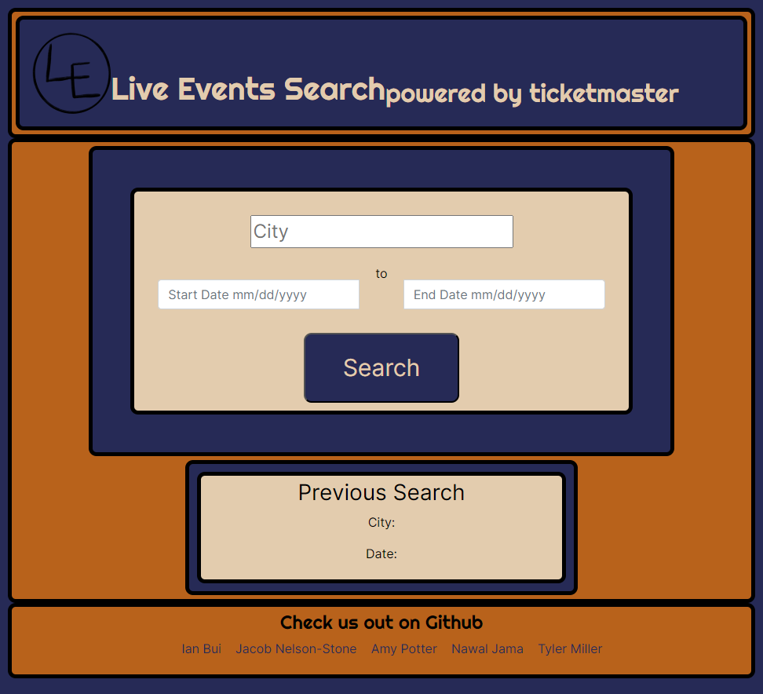
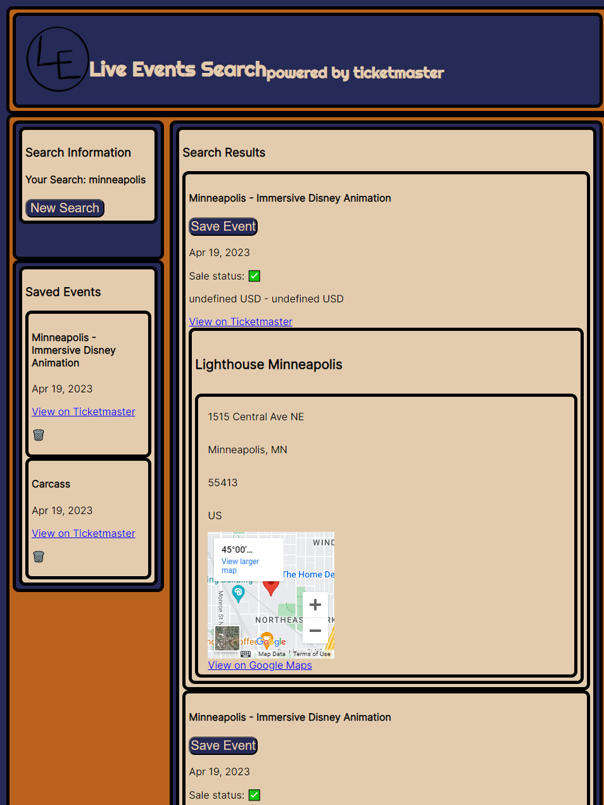

# Live Event had requested an API key from Bands In Town, but did not recieve word in time and switched to using Serp API Search Ticket Master API
## About
Welcome to our repository for group project 1! We have created a web application using third party APIs. Initially, we for Google Events. This, too, was an issue as Serp API only wants their keys to be used server-side. For our application, we created an event search engine using tickemaster's API. This application utilizes HTML, CSS, Javascript, Bootstrap, JQuery, and Dayjs over the two pages. Users can search events by city and date, and save events they are interested in.

## Screenshot

## Live page
Open [https://jacobdnelsonstone.github.io/live-music-search-ticketmaster-api/](https://jacobdnelsonstone.github.io/live-music-search-ticketmaster-api/) with your browser to see the result.
## Creators
Jacob Nelson-Stone, Ian Bui, Tyler Miller, Amy Potter and Nawal Jama.